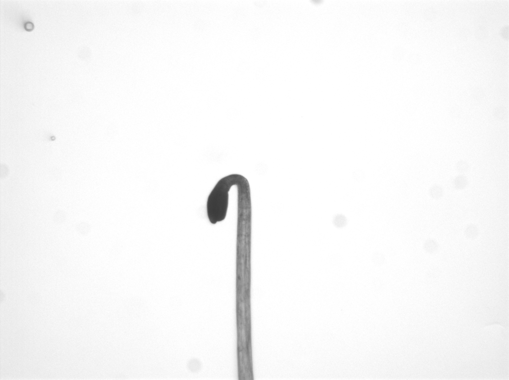
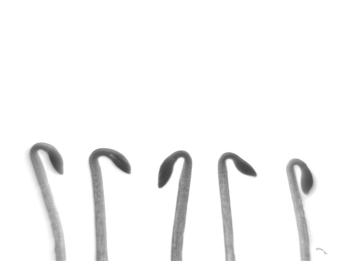

# HypoQuantyl
An image processing and analysis tool for automated, high-throughput
measurements of hypocotyl growth kinematics. [*Publication currently under
review*]

#### Growth Kinematics
Growth kinematics describes the spatial distribution of growth along a surface.
In plants, this refers to the rate of elongation of cells along different
regions of the stem. Historically, this has been measured using external
markers along the stem's length. **HypoQuantyl** achieves this by tracking
distinct texture patches along the midline of the hypocotyl over time. These
patches, or 'elements,' represent stem segments, and their expansion allows
the software to calculate growth rates expressed as the Relative Elemental
Growth Rate (REGR).

#### Machine Learning-Based Segmentation
HypoQuantyl provides an automated and robust segmentation process for each
frame in a time series of images and is capable of handling multiple well-
separated seedlings per image. The machine learning-based segmentation pipeline
generates contours of the upper hypocotyl, resolves cotyledon overlap, and
identifies and splits the contour at the hypocotyl-cotyledon junction. The
system is self-correcting, ensuring reliable results. From the contour, it
generates a midline used to compute REGR.

#### High-Throughput Capabilities
The automated nature of the processing and segmentation pipeline allows
deployment on distributed computing servers provided by
[HTCondor](https://htcondor.org/). Using these servers, we have analyzed over
23,000 individual images in a high-throughput manner.

---

### Getting Started
To use **HypoQuantyl**, ensure your system meets the following requirements:

- **MATLAB Version**:
  This tool was developed for MATLAB R2018a to R2022b. Other versions may
  work but are not guaranteed.

- **Required MATLAB Toolboxes**:
  - [Curve Fitting Toolbox](https://www.mathworks.com/products/curvefitting.html)
  - [Global Optimization Toolbox](https://www.mathworks.com/products/global-optimization.html)
  - [Image Processing Toolbox](https://www.mathworks.com/products/image-processing.html)
  - [Mapping Toolbox](https://www.mathworks.com/products/mapping.html)
  - [Parallel Computing Toolbox](https://www.mathworks.com/products/parallel-computing.html)
  - [Sensor Fusion and Tracking Toolbox](https://www.mathworks.com/products/sensor-fusion-and-tracking.html)
  - [Signal Processing Toolbox](https://www.mathworks.com/products/signal.html)
  - [Statistics and Machine Learning Toolbox](https://www.mathworks.com/products/statistics.html)
  - [Symbolic Math Toolbox](https://www.mathworks.com/products/symbolic.html)
  - [Wavelet Toolbox](https://www.mathworks.com/products/wavelet.html)

- Clone the repository:
   ```bash
   git clone https://github.com/jbustamante35/hypoquantyl.git
   ```

- Install the required MATLAB toolboxes listed above. Check using the
  following command in the Matlab console:
   ```matlab
   matlab.addons.installedAddons;
   ```

### Running HypoQuantyl
1. Add this repository to your MATLAB path
    - **NOTE!** make sure to remove the `./.git` subfolder to avoid a messy path

2. Download example image stacks in our lab's [Dryad Data Repository](http://datadryad.org/stash/share/Vh8MaMvB8jRan1BAWxIqm1qiKayizm4Hr056hgtR2MI)
     - Sample images are time-lapse image stacks of the following (see bottom of page):
        - [`single_seedling.zip`] Single *cry1* mutant seedling grown for 8 h in darkness *[91 MB]*
        - [`multiple_seedling.zip`] Five *wt* seedlings grown for 6 h in blue light, after an initial 2 h in darkness *[20 MB]*

   Sample Images: </br>
   **`single_seedling.zip`**
   

   **`multiple_seedling.zip`**
   


4. Download the `HQ.mat` dataset that contains neural net models, PCA
   eigenvectors, helper functions, and constants required to run this
   program *[62 MB]*.

5. Open [*hypoquantyl_script.m*](./hypoquantyl_script.m) in the matlab editor
   to set input parameters, point to the image stack folder, and set the output
   destination folder.

   ```matlab
   edit hypoquantyl_script;
   ```

   Once opened, select which sample time course set to analyze [`tset` ,
   `cset` , `gset`], then set parameters for verbosity (`vrb`), saving results
   into a .mat file (`sav`), using parallelization (`par`), output directory
   (`odir`), and date of analysis (`edate`).

   ```matlab
   %% HypoQuantyl Parmeters Script
   % Select sample data to run. Uncomment as needed.

   % Single cry1 mutant grown for 8 h darkness [single_seedling.zip]
   % tset = 'single'; % Sample type
   % cset = 'dark';   % Condition
   % gset = 'cry1';   % Genotype

   % Five wt seedlings grown for 2 h darkness, then 6 h blue light [multiple_seedling.zip]
   tset = 'multiple'; % Sample type
   cset = 'blue';     % Condition
   gset = 'col0';     % Genotype

   % File path to where you downloaded and unzipped the sample images
   path_to_data = '/home/username/Downloads/testimages';

   % General options
   vrb   = 1;     % Verbosity [ 0 none | 1 verbose ]
   sav   = 1;     % Save results into .mat files?
   par   = 1;     % Use parallel processing [0 | 1]
   odir  = pwd;   % Directory path to store results [default pwd]
   edate = tdate; % Date of analysis [format string as 'YYMMDD' to set manually]

   % Advanced parameters are below these lines but
   % is not recommended to toggle unless you know what they do
   ```

6. Run `HypoQuantyl.m` in the Matlab console!

   ```matlab
   HQ = HypoQuantyl;`
   ```

   Runtimes may vary drastically depending on processing power, total CPU
   threads, and use of the parallel processing parameter. On our
   ***CENT OS RHEL 7*** Linux server with an ***Intel Xeon Silver 4210R*** CPU
   of **40 cores** and **376 GB RAM**, analyzing a single seedling for 96
   frames using the default parameters takes about **10 min**.

7. Analysis of Results

---

### Pipeline Overview:
1. **Input**: High-resolution time-lapse image sequence of *A. thaliana*
   hypocotyls.
   - Image resolution must clearly capture natural textures along the
     seedling.
   - Growth between frames should not exceed 20 pixels for accurate tracking.\*
   - **Filename convention**: *condition_genotype_tframe.TIF*
     - **Example**: `blue_cry1_t020.TIF` refers to the 20th frame of a *cry1*
        mutant under blue light conditions.
   - **Directory structure**:
     - `condition/genotype/imagestacks/imageframes/`
     - **Example**:
     `.../multiple/dark/cry1/230220_dark_cry1/dark_cry1_t001.TIF`

    ##### **Sample Movie** </br>

    </br></br></br>


2. **Image Processing**: Grayscale thresholding and basic object detection to
prepare the seedlings for segmentation.
   - Hypocotyls are isolated and split into upper and lower regions. \**

    </br></br></br>

4. **Segmentation Pipeline**: A 3-stage machine learning pipeline generates the
   midline used to measure growth kinematics.
   - **S-Phase**: A 'seeding' phase where a convolutional neural network (CNN)
     initializes the grayscale image with reference frames.
   - **C-Cycle**: A recursive feed-forward neural network loop that predicts
     'Contour' points based on the S-Phase reference frames and image data.
   - **R-Cycle**: A refinement loop that evaluates the output through a
     minimization function. The 'grade' is the probability that the output is
     within bounds of the ground truth dataset. If the threshold isn't met,
     the process is retried with adjustments.

6. **REGR Measurements**: Calculates the Relative Elemental Growth Rate (REGR) -
   - Expressed as a %/hour to describe how 'elements' moved away from the top
     or apex of the seedling.

\* *20 pixels is the threshold used for our purposes, but the actual limit may be higher.* </br>
\** *The segmentation pipeline processes only the upper region; lower regions are segmented using basic grayscale thresholding.*

---

### Authors
**Julian Bustamante**, Graduate Researcher in Cellular and Molecular Biology
(<jbustamante@wisc.edu>) \\
University of Wisconsin - Madison, Department of Botany

**Nathan Miller**, Senior Scientist (<ndmill@gmail.com>) \\
University of Wisconsin - Madison, Department of Botany

#### Acknowledgements
**Guosheng Wu**: Generated the original image dataset used to train early
machine learning models.

#### License
MIT license can be found in the [LICENSE](./LICENSE) file.

