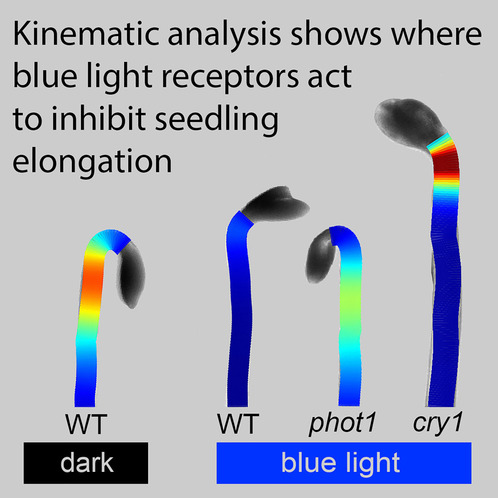
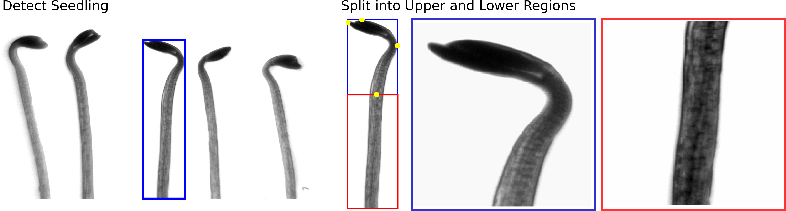

# HypoQuantyl
An image processing and analysis tool for automated, high-throughput
measurements of hypocotyl growth kinematics.

**Refer to the publication resulting from this study:** <br />
[Separate sites of action for cry1 and phot1 blue-light receptors in the
Arabidopsis hypocotyl](https://www.cell.com/current-biology/fulltext/S0960-9822(24)01562-8)

 <br /><br />

#### Growth Kinematics
Growth kinematics describes the spatial distribution of growth along a surface.
In plants, this refers to the rate of elongation of cells along different
regions of the stem. Historically, this has been measured using external
markers along the stem's length. **HypoQuantyl** achieves this by tracking
distinct texture patches along the midline of the hypocotyl over time. These
patches, or 'elements,' represent stem segments, and their expansion allows
the software to calculate growth rates expressed as the Relative Elemental
Growth Rate (REGR).

#### Machine Learning-Based Segmentation
HypoQuantyl provides an automated and robust segmentation process for each
frame in a time series of images and is capable of handling multiple well-
separated seedlings per image. The machine learning-based segmentation pipeline
generates contours of the upper hypocotyl, resolves cotyledon overlap, and
identifies and splits the contour at the hypocotyl-cotyledon junction. The
system is self-correcting, ensuring reliable results. From the contour, it
generates a midline used to compute REGR.

#### High-Throughput Capabilities
The automated nature of the processing and segmentation pipeline allows
deployment on distributed computing servers provided by
[HTCondor](https://htcondor.org/). Using these servers, we have analyzed over
23,000 individual images in a high-throughput manner.

---

### Getting Started
#### **System Recommendations**:
  - This software was optimized for **Linux operating systems** and has been
   tested on **MacOS**. We have not yet tested on **Windows**. There may be
   some places that do not handle the differences in file path conventions
   *(using '/' in Linux/Mac vs '<br />' in Windows*).

  - If running with `parallel` flag (`par = 1`), I recommend a machine with
  **>12 CPU cores** to ensure stability.

  - **8+ GB RAM** minimum, and **24+ GB** if using `parallel` flag.

- **MATLAB Version**: <br />
  This tool was developed on Matlab **R2018a** to **R2022b**. Versions
  slightly earlier and later should work fine but are not guaranteed.

#### **MATLAB Toolboxes**:
  - [Curve Fitting Toolbox](https://www.mathworks.com/products/curvefitting.html)
  - [Global Optimization Toolbox](https://www.mathworks.com/products/global-optimization.html)
  - [Image Processing Toolbox](https://www.mathworks.com/products/image-processing.html)
  - [Mapping Toolbox](https://www.mathworks.com/products/mapping.html)
  - [Sensor Fusion and Tracking Toolbox](https://www.mathworks.com/products/sensor-fusion-and-tracking.html)
  - [Signal Processing Toolbox](https://www.mathworks.com/products/signal.html)
  - [Statistics and Machine Learning Toolbox](https://www.mathworks.com/products/statistics.html)
  - [Symbolic Math Toolbox](https://www.mathworks.com/products/symbolic.html)
  - [Wavelet Toolbox](https://www.mathworks.com/products/wavelet.html)

  (Optional) if you run pipeline with `parallel` flag (`par = 1`).
  - [Parallel Computing Toolbox](https://www.mathworks.com/products/parallel-computing.html)

  - Install the required MATLAB toolboxes listed above. **Verify** your
  toolboxes using using the following Matlab console command:
   ```matlab
   matlab.addons.installedAddons;
   ```

#### Download Neural Net Models
- Download the `HQ.mat` file from our lab's [Dryad data repository](http://datadryad.org/stash/share/Vh8MaMvB8jRan1BAWxIqm1qiKayizm4Hr056hgtR2MI).
This contains neural net models, PCA eigenvectors, helper functions, and
constants required to run this program *[64 MB]*.

#### Download Sample Image Datasets
- Download example image stacks from the same [Dryad repository](http://datadryad.org/stash/share/Vh8MaMvB8jRan1BAWxIqm1qiKayizm4Hr056hgtR2MI).
  See below in **Pipeline Overview** for details about filename conventions.

     - The sample data are time-lapse image stacks of the following:
        - [`single_seedling.zip`] Single *cry1* mutant seedling grown for 8 h in darkness *[96 MB]*
        - [`multiple_seedling.zip`] Five *wt* seedlings grown for 6 h in blue light, after an initial 2 h in darkness *[20 MB]*

       **`single_seedling.zip`** <br />
        <br />

       <br /><br />

       **`multiple_seedling.zip`** <br />
       

     - Place image stacks and `HQ.mat` into the **same directory**. Make sure
       this code repository is in a separate directory.

       ```bash
       mkdir analysis_folder;

       mv single_seedling.zip analysis_folder;
       mv multiple_seedling.zip analysis_folder;
       mv HQ.mat analysis_folder;

       cd analysis_folder;

       unzip single_seedling.zip
       unzip multiple_seedling.zip
       ```
#### Clone this repository:

       git clone https://github.com/jbustamante35/hypoquantyl.git

   - Add `hypoquantyl` to your MATLAB path **(with subfolders)**
     - **NOTE!** remember to remove the `./.git` subfolder to avoid messy paths

### Running HypoQuantyl
1. Open [*hypoquantyl_script.m*](./hypoquantyl_script.m) in the matlab editor.

   ```matlab
   edit hypoquantyl_script;
   ```

2. In the script, set general options as needed: <br />
  **(1)** [`tset `] Sample image stack to analyze  <br />
  **(2)** [`vrb  `] Verbosity <br />
  **(3)** [`sav  `] Save results into .mat files <br />
  **(4)** [`par  `] Run with  parallelization [see above on *System Requirements*],  <br />
  **(5)** [`odir `] File path to output directory <br />
  **(6)** [`edate`] Date of analysis <br />

   `hypoquantyl_script.m`
   ```matlab
   %% HypoQuantyl Parmeters Script

   % 1) Select sample data to run. Uncomment as needed.
   tset = 'single'; % [single_seedling.zip]   1 cry1 mutant grown for 8h in darkness
   % tset = 'multiple'; % [multiple_seedling.zip] 5 wt seedlings grown for 2h in darkness then 6h blue light

   % 2) File path to where you downloaded and unzipped the sample images
   % path_to_data = '/home/username/Downloads/testimages';

   % 3) General options
   vrb   = 1;     % Verbosity [ 0 none | 1 verbose ]
   sav   = 1;     % Save results into .mat files
   par   = 0;     % Use parallel processing [0 | 1]
   odir  = pwd;   % Directory path to store results [default pwd]

   % Advanced parameters are below, but not recommended to toggle unless you know
   % how they are implemented in this pipeline
   ```

3. Run `HypoQuantyl.m` in the Matlab console!

   - A testing script is provided in
   [tests/hypoquantyl_testing_script.m](tests/hypoquantyl_testing_script.m).

   Or simply run:

   ```matlab
   HQ = HypoQuantyl;
   ```

4. Analysis of Results **[to-do]**
   - Results are stored in the location set as the output directory (`odir`).


#### NOTE ABOUT PERFORMANCE
   Runtimes may vary drastically depending on processing power, total CPU
   threads, and use of the parallel processing parameter.

   On our ***CENT OS RHEL 7*** Linux server with an ***Intel Xeon Silver
   4210R*** CPU of **40 cores**, analyzing a single seedling for 96 frames
   takes about **10 min**.

   On a conventional personal laptop with **8 cores** and no use of parallel
   processing, a single seedling may take over **5 hours**.

---

### Pipeline Overview:
1. **Input**: High-resolution time-lapse image sequence of *A. thaliana*
   hypocotyls.
   - Image resolution must clearly capture natural textures along the
     seedling.
   - Growth between frames should not exceed 20 pixels for accurate tracking.\*
   - **Filename convention**: *condition_genotype_tframe.TIF*
     - **Example**: `blue_cry1_t020.TIF` refers to the 20th frame of a *cry1*
        mutant under blue light conditions.
   - **Directory structure**:
     - `condition/genotype/imagestacks/imageframes/`
     - **Example**:
     `.../multiple/dark/cry1/230220_dark_cry1/dark_cry1_t001.TIF`

    ##### **Sample Movie** <br />

    <br /><br /><br />


2. **Image Processing**: Grayscale thresholding and basic object detection to
prepare the seedlings for segmentation.
   - Hypocotyls are isolated and split into upper and lower regions. \**

    <br /><br /><br />

**[to-do]** finish pipeline descriptions

4. **Segmentation Pipeline**: A 3-stage machine learning pipeline generates the
   midline used to measure growth kinematics.
   - **S-Phase**: A 'seeding' phase where a convolutional neural network (CNN)
     initializes the grayscale image with reference frames.
   - **C-Cycle**: A recursive feed-forward neural network loop that predicts
     'Contour' points based on the S-Phase reference frames and image data.
   - **R-Cycle**: A refinement loop that evaluates the output through a
     minimization function. The 'grade' is the probability that the output is
     within bounds of the ground truth dataset. If the threshold isn't met,
     the process is retried with adjustments.

6. **REGR Measurements**: Calculates the Relative Elemental Growth Rate (REGR) -
   - Expressed as a %/hour to describe how 'elements' moved away from the top
     or apex of the seedling.

\* *20 pixels is the threshold used for our purposes, but the actual limit may be higher.* <br />
\** *The segmentation pipeline processes only the upper region; lower regions are segmented using basic grayscale thresholding.*

---

### Authors
**Julian Bustamante**, PhD Researcher (<jbustamante@wisc.edu>) <br />
University of Wisconsin - Madison, Department of Botany

**Nathan Miller**, Senior Scientist (<ndmill@gmail.com>) <br />
University of Wisconsin - Madison, Department of Botany

#### Acknowledgements
**Guosheng Wu**: Generated the original image dataset used to train early
machine learning models.

#### License
MIT license can be found in the [LICENSE](./LICENSE) file.

